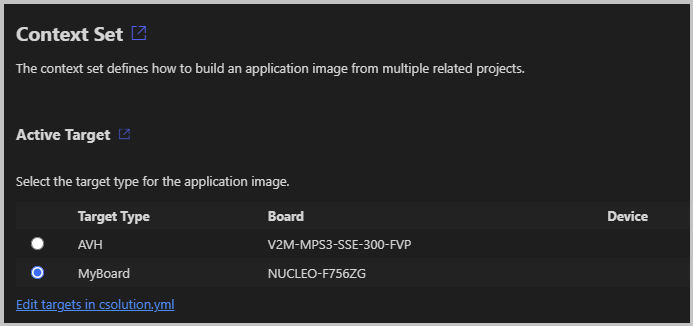
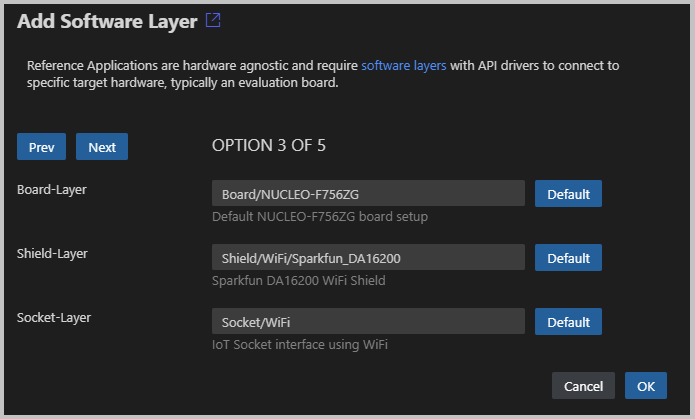

[](https://github.com/Arm-Examples/AWS_MQTT_Demo/blob/main/LICENSE)
[](https://github.com/Arm-Examples/AWS_MQTT_Demo/tree/main/.github/workflows/AWS_MQTT-ci.yml)

# AWS MQTT Demo

This demo application connects to **AWS MQTT broker** using TLS with mutual authentication between the client and the server.
It demonstrates the subscribe-publish workflow of MQTT.

Visit [*coreMQTT mutual authentication demo*](https://docs.aws.amazon.com/freertos/latest/userguide/mqtt-demo-ma.html) for further information. 
Please note, that [*properly configured thing*](https://docs.aws.amazon.com/iot/latest/developerguide/iot-moisture-create-thing.html) is required to
successfully run the demo application.

## Requirements

- [AWS Account](https://aws.amazon.com/free) to connect a [*AWS IoT Thing*](https://docs.aws.amazon.com/iot/latest/developerguide/iot-moisture-create-thing.html).
- A CMSIS-Toolbox enabled toolchain such as [Keil Studio for VS Code](https://www.keil.arm.com/). The [MDK Community Edition](https://www.keil.arm.com/keil-mdk/#mdk-v6-editions) provides all tools required for evaluation.

## Project Structure

This AWS MQTT Mutual Authentication example uses the [CMSIS-Toolbox](https://github.com/Open-CMSIS-Pack/cmsis-toolbox/blob/main/docs/README.md#cmsis-toolbox)
*csolution project format* with CMSIS software packs and software layers. The default configuration uses a AVH-FVP simulation model.
No physical hardware is required to explore this example. By using different layers it can run on physical evaluation boards,
use different communication stacks, or WiFi modules.

Project File                                                                 | Description
:----------------------------------------------------------------------------|:----------------------------------------------------
[`Demo.csolution.yml`](Demo.csolution.yml)                                   | Specifies the target hardware, build types, and defines the actual software layers used.
[`Demo.cproject.yml`](Demo.cproject.yml)                                     | Contains the source files and components that belong to user application.
[`Socket/.../Socket.clayer.yml`](Socket/VSocket/Socket.clayer.yml)           | Contains the source files and components of the communication interface.
[`Board/.../Board.clayer.yml`](Board/AVH_MPS3_Corstone-300/Board.clayer.yml) | Contains the hardware interfaces to the device and board peripherals.
`Shield/.../Shield.clayer.yml`                                               | Contains the interface source files to an optional Arduino WiFi Shield.

## Configure AWS IoT Thing

To run the demo application [*configure the AWS IoT Thing*](https://docs.aws.amazon.com/iot/latest/developerguide/iot-moisture-create-thing.html) with these steps:

- Modify the following definitions in [config_files/aws_clientcredential.h](amazon-freertos/demos/include/aws_clientcredential.h):
  - `clientcredentialMQTT_BROKER_ENDPOINT`: Remote Host Address (AWS IoT->Settings in AWS IoT console)
  - `clientcredentialIOT_THING_NAME`: Thing Name (AWS IoT->Manage->Things->Name in AWS IoT console)

- Modify the following definitions in [config_files/aws_clientcredential_keys.h](amazon-freertos/demos/include/aws_clientcredential_keys.h):
  - `keyCLIENT_CERTIFICATE_PEM`: Client Certificate
  - `keyCLIENT_PRIVATE_KEY_PEM`: Client Private Key

## Run on AVH FVP Simulation Model

Once the *AWS IoT Thing* is configured it can be build and run on AVH FVP simulation models.

```bash
cbuild Demo.csolution.yml --context .Debug+AVH --packs
FVP_Corstone_SSE-300 -f Board/AVH_MPS3_Corstone-300/fvp_config.txt out/Demo/AVH/Debug/Demo.axf -Q 10
```

The execution on AVH FVP simulation models should create this output:

```txt
0 0 [iot_thread] [INFO ][DEMO][0] ---------STARTING DEMO---------
1 1 [iot_thread] [INFO ][INIT][1] SDK successfully initialized.
2 1 [iot_thread] [INFO ][DEMO][1] Successfully initialized the demo. Network type for the demo: 4
3 2 [iot_thread] [INFO] Creating a TLS connection to xxx-ats.iot.us-east-2.amazonaws.com:8883.
4 3161 [iot_thread] [INFO] Creating an MQTT connection to xxx-ats.iot.us-east-2.amazonaws.com.
...
10 3323 [iot_thread] [INFO] An MQTT connection is established with xxx-ats.iot.us-east-2.amazonaws.com.
11 3324 [iot_thread] [INFO] Attempt to subscribe to the MQTT topic thing/example/topic.
12 3325 [iot_thread] [INFO] SUBSCRIBE sent for topic thing/example/topic to broker.
13 3465 [iot_thread] [INFO] Packet received. ReceivedBytes=3.
14 3465 [iot_thread] [INFO] Subscribed to the topic thing/example/topic with maximum QoS 1.
15 4465 [iot_thread] [INFO] Publish to the MQTT topic thing/example/topic.
16 4465 [iot_thread] [INFO] Attempt to receive publish message from broker.
17 4726 [iot_thread] [INFO] Packet received. ReceivedBytes=2.
18 4726 [iot_thread] [INFO] Ack packet deserialized with result: MQTTSuccess.
19 4726 [iot_thread] [INFO] State record updated. New state=MQTTPublishDone.
20 4727 [iot_thread] [INFO] PUBACK received for packet Id 2.
21 4757 [iot_thread] [INFO] Packet received. ReceivedBytes=38.
22 4757 [iot_thread] [INFO] De-serialized incoming PUBLISH packet: DeserializerResult=MQTTSuccess.
23 4758 [iot_thread] [INFO] State record updated. New state=MQTTPubAckSend.
24 4758 [iot_thread] [INFO] Incoming QoS : 1
25 4758 [iot_thread] [INFO] Incoming Publish Topic Name: thing/example/topic matches subscribed topic.Incoming Publish Message : Hello World!
...
235 67150 [iot_thread] [INFO] Unsubscribe from the MQTT topic thing/example/topic.
236 67250 [iot_thread] [INFO] Packet received. ReceivedBytes=2.
237 67250 [iot_thread] [INFO] Unsubscribed from the topic thing/example/topic.
238 68250 [iot_thread] [INFO] Disconnecting the MQTT connection with xxx-ats.iot.us-east-2.amazonaws.com.
239 68250 [iot_thread] [INFO] Disconnected from the broker.
240 68251 [iot_thread] [INFO] Demo completed an iteration successfully.
241 68251 [iot_thread] [INFO] Demo iteration 3 completed successfully.
242 68252 [iot_thread] [INFO] Short delay before starting the next iteration....
243 73252 [iot_thread] [INFO] Demo run is successful with 3 successful loops out of total 3 loops.
...
248 74254 [iot_thread] [INFO ][DEMO][74254] Demo completed successfully.
249 74254 [iot_thread] [INFO ][INIT][74254] SDK cleanup done.
250 74255 [iot_thread] [INFO ][DEMO][74254] -------DEMO FINISHED-------
```

The MQTT messages can be viewed in the [**AWS IoT console**](https://docs.aws.amazon.com/iot/latest/developerguide/view-mqtt-messages.html).

## Configure for Evaluation Boards

The **AWS MQTT Demo** can be deployed to physical evaluation boards using these steps:

- The [`pack: MDK-Packs::IoT_Socket`](https://www.keil.arm.com/packs/iot_socket-mdk-packs) is the interface to the [communication stack](https://mdk-packs.github.io/IoT_Socket/latest/iot_socket_using.html#iot_socket_select).
- Select a Board that offers suitable board layer. Several [Board Support Packs for ST Boards](https://www.keil.arm.com/boards/?q=&vendor=stmicroelectronics) contain a suitable board layer for this MQTT example. The pack overview lists the [Provided API Interfaces](https://www.keil.arm.com/packs/nucleo-f756zg_bsp-keil). The IoT Socket interface requires for Ethernet `CMSIS_ETH`, for WiFi `ARDUINO_UNO_I2C` or `ARDUINO_UNO_UART`.
- The [`pack: ARM::CMSIS-Driver`](https://www.keil.arm.com/packs/cmsis-driver-arm) provides the layers for various [WiFi modules](https://arm-software.github.io/CMSIS-Driver/latest/shield_layer.html#shield_WiFi). These connect to boards that provide Arduino connectors.

Depending on the selected hardware, the file [`Demo.csolution.yml`](Demo.csolution.yml) is configured.  Below the configuration for `NUCLEO-F756ZG` is shown.

```yml
   packs:
    - pack: ARM::V2M_MPS3_SSE_300_BSP@1.5.0
    - pack: Keil::NUCLEO-F756ZG_BSP@2.0.0       # Add BSP
    - pack: ARM::CMSIS-Driver@2.10.0            # Add CMSIS-Driver for WiFi Shields

  target-types:
    - type: AVH
      board: ARM::V2M-MPS3-SSE-300-FVP
        :

    - type: MyBoard
      board: NUCLEO-F756ZG                      # Add board name
```

### Using [Keil Studio for VS Code](https://www.keil.arm.com/)

Once, the file [`Demo.csolution.yml`](Demo.csolution.yml) is configured, use the **Manage Solution** view and change the **Active Target**.



The IDE will evaluate the compatible software layers and shows the **Configure Solution** view. Depending on the board several options can be selected.  Click **OK** to choose a selection.



This completes the setup and the file [`Demo.csolution.yml`](Demo.csolution.yml) now contains the settings for the layers.

```yml
  target-types:
    - type: AVH
      board: ARM::V2M-MPS3-SSE-300-FVP
        :
    - type: MyBoard
      board: NUCLEO-F756ZG
      variables:
        - Board-Layer: $SolutionDir()$/Board/NUCLEO-F756ZG/Board.clayer.yml
        - Shield-Layer: $SolutionDir()$/Shield/WiFi/Sparkfun_DA16200/Shield.clayer.yml
        - Socket-Layer: $SolutionDir()$/Socket/WiFi/Socket.clayer.yml
```

Use **Build solution** to translate the application.

### Manual Configuration

Refer to [CMSIS-Toolbox - Reference Applications - Usage](https://github.com/Open-CMSIS-Pack/cmsis-toolbox/blob/main/docs/ReferenceApplications.md#usage) for use command line tools to obtain above information.  However you may also use the CMSIS-Toolbox command `csolution list layers` to obtain information about the layers that are available in the installed packs.  These layers may be copied to your project directory and defined as shown above.

```bash
csolution list layers
.../Arm/Packs/ARM/CMSIS-Driver/2.10.0/Shield/WiFi/Inventek_ISMART43362-E/Shield.clayer.yml (layer type: Shield)
.../Arm/Packs/ARM/CMSIS-Driver/2.10.0/Shield/WiFi/Sparkfun_DA16200/Shield.clayer.yml (layer type: Shield)
.../Arm/Packs/ARM/CMSIS-Driver/2.10.0/Shield/WiFi/Sparkfun_ESP8266/Shield.clayer.yml (layer type: Shield)
.../Arm/Packs/ARM/CMSIS-Driver/2.10.0/Shield/WiFi/WizNet_WizFi360-EVB/Shield.clayer.yml (layer type: Shield)
.../Arm/Packs/Keil/NUCLEO-F756ZG_BSP/2.0.0/Layers/Default/Board.clayer.yml (layer type: Board)
.../Arm/Packs/MDK-Packs/IoT_Socket/1.4.0/layer/FreeRTOS_Plus_TCP/Socket.clayer.yml (layer type: Socket)
.../Arm/Packs/MDK-Packs/IoT_Socket/1.4.0/layer/MDK_Network_ETH/Socket.clayer.yml (layer type: Socket)
.../Arm/Packs/MDK-Packs/IoT_Socket/1.4.0/layer/VSocket/Socket.clayer.yml (layer type: Socket)
.../Arm/Packs/MDK-Packs/IoT_Socket/1.4.0/layer/WiFi/Socket.clayer.yml (layer type: Socket)
```

Use **cbuild** to translate the application.

```bash
cbuild Demo.csolution.yml --context .Debug+MyBoard --packs
```

## Build and Run

Once the application is translated use:

- A programmer or debugger to download the application.
- Run the application and view messages in a debug printf or terminal window.

## Issues

Please feel free to raise an [issue](https://github.com/Arm-Examples/AWS_MQTT_Demo/issuesW) on GitHub to report problems.